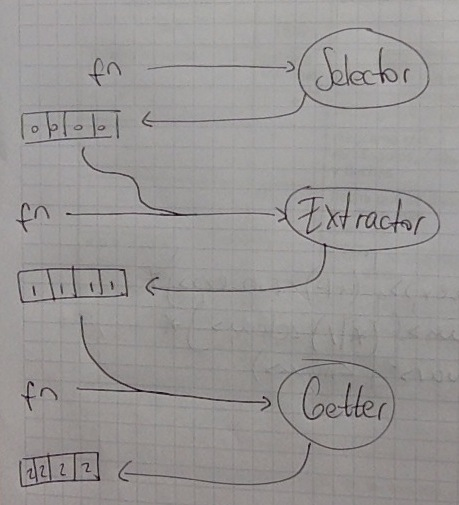

# Cambios

## Query

A partir de ahora, usaremos el patrón *prepared statement* para referirnos a la actividad de la *Query*. Nos enfocaremos sólo en la *SemanticQuery*.

## Retorno de un hash por parte del Getter

Es una cuestión de implementación, se verá cuando se implemente el Getter.

## Mantener la referencia a elementos previos

#### Esquema actual

El *Selector* recibe una *function* mediante la cual obtiene una colección de elementos del *DOM*. El *Extractor* recibe la colección de elementos del *DOM* y una función, que aplica sobre los elementos, obteniendo una nueva colección, esta vez de datos. El *Getter* recibe la colección de datos y los envía a una *Query* que retorna información obtenida a partir de los datos; retorna una colección de hashes en los que se encuentra dicha información. Y así.

#### Nuevo esquema

Se quiere poder acceder de una forma sencilla a las instancias previas de un elemento; por ejemplo, al elemento del DOM del que se obtuvo la información en una *Query*. Para ello vamos a tener una clase **Element** que conocerá:

* al elemento HTML original (obtenido por el *Selector*);
* al elemento derivado del HTML (obtenido por el *Extractor*);
* al elemento contenedor de la información adicional obtenida por la *Query* (y procesada por el *Getter*);
* al elemento HTML construido por el *Builder* con la información adicional.

Cada objeto de la cadena deberá adaptarse para interactuar con *Element*.

La *function* recibida por el **Selector** seguirá ocupándose de obtener una colección del *DOM*, pero este luego generará un objeto *Element* para cada elemento en ella, y le seteará el elemento HTML mediante el mensaje `#setSelected(object)`.

El **Extractor** recibirá la colección anterior y a cada *Element* le pedirá su `#selected()`, a partir de los cuales obtendrá los datos concretos y los agregará al *Element* mediante `#setExtracted(object)`. Luego retornará la colección; antes creaba una nueva colección, ahora simplemente retorna la que recibió, ya que agregó los datos a la misma.

El **Getter** recibirá la colección anterior y a cada *Element* le pedirá su `#extracted()`, el cual enviará a la *Query*, obteniendo la información adicional, que agregará al *Element* mediante `#setGotten(hash)`. Luego retornará la colección. Al igual que en el *Extractor*, la colección ahora es la que recibió.

El **Builder** recibirá la colección anterior y tendrá a su disposición todas las *mutaciones* de cada elemento, desde el HTML crudo hasta el hash con la información adicional obtenida semánticamente. *Construirá* el HTML a partir del template recibido, de la información adicional, que obtendrá mediante `#gotten()`, y de alguna de las otras mutaciones del *Element* si así lo requiere. Agregará el HTML construido al *Element* mediante `#setBuilt(object)`.

El **Injector** recibirá la colección anterior y hará lo suyo. *Aún falta definir algunas cuestiones sobre este objeto*.