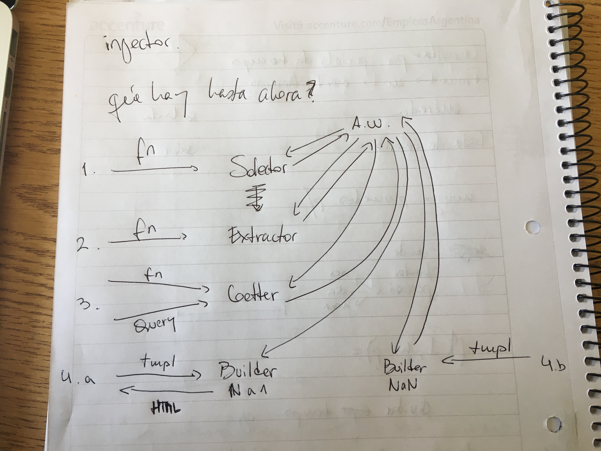
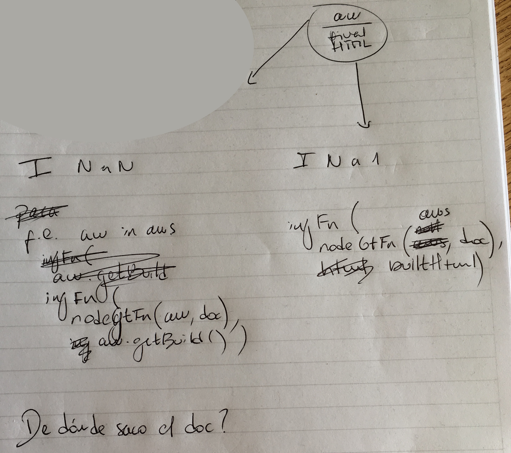

## Qué tenemos hasta ahora

## Injector

**Objetivo**: modificar el DOM de alguna forma.

**Entrada**:

* `nodeGetterFunction`: recibe `aw` y `dom` y retorna un nodo
* `injectionFunction`: recibe un nodo y el objeto `built` y lleva a cabo alguna modificación sobre el nodo involucrando a `built`

**NaN vs Na1**:

El I NaN usará `aw` para obtener el `built`. El I Na1 lo tendría que recibir de alguna forma.

Para simplificar el uso de `Injector` dentro de `Augmentation`, `Injector#run` recibe tres argumentos:

* `augmentationWrappers`: necesario para NaN, y pasado a la función `nodeGetterFunction` en ambos
* `built`: necesario para la inyección en Na1, ignorado en NaN
* `doc`: hackazo para facilitar los tests