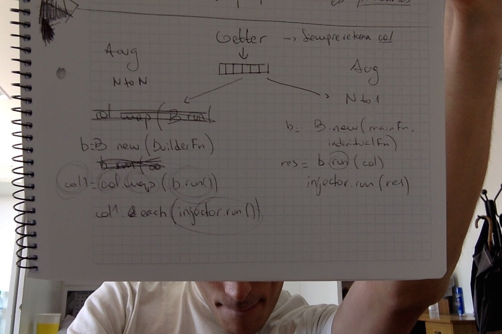

# Classes - SWA

* **Selector**:
	* *Responsibility*: takes a collection of objects or elements from the document and returns them.
	* *Needs*: a way to actually take the element or object; i.e., a function.
* **Extractor**:
	* *Responsibility*: extracts some relevant data from the collection returned by a *selector*.
	* *Needs*: a way to deal with the elements; i.e., a function.
* **Query**:
	* *Responsibility*: performs a query over the Internet and gets a set of raw data.
	* *Needs*: the target of the query, e.g. the semantic endpoint or a website, and the query itself, e.g. the SPARQL query or the function to get some element from the document. 
* **Getter**: 
	* *Responsibility*: takes a collection of items and a query object, and launches it with every item, taking then the raw data returned by it and processing it, extracting the relevant information.
	* *Needs*: a way to process the data; i.e., a function.
* **Builder**:
	* *Responsibility*: constructs HTML elements given the information generated by 1 o more *getters*.
	* *Needs*: the elements to construct and how to do it; i.e., a function.
* **Injector**:
	* *Responsibility*: introduces the augmentation into the document. Can be from modifying a current element or inserting one received from a *builder*.
	* *Needs*: the way to interact with the document and modify it; i.e., a function.

# Thoughs

* **Extractor** could work with 1 to N elements. We could abstract from this by always treating  element returned by selector as a collection.
* Should **Queries** be called from within the **Getter**, or should them be called from outside, as **Selectors** are? For now, we'll give that responsibility to the **Getter**.
* N to N **Builders** could separate its steps in a) construct the main HTML element, and b) construct the individual HTML elements and add them to the main one. This would require to set two functions to **Builders**, instead of one: the one to construct the main element, and the one to construct the individual ones. For now, we decided to keep it simple and just insert all the logic into one function.
* Tenemos dos posibilidades de augmentation: NaN y Na1. El Getter siempre retorna una collection.

	* *NaN*: el builder recibe un dato, y, mediante una function que le es seteada, genera un elemento HTML en el que incluye este dato. Se hace un map de la collection retornada por el getter en el que se invoca al builder. Con la nueva collection, se hace un each y se invoca al injector.
	* *Na1*: el builder debe conocer dos funciones: una para generar el elemento HTML main, y otra para cada dato particular. Recibe la collection retornada por el getter y para cada elemento invoca a la función individual. Retorna un elemento HTML con todos los datos, el cual es pasado al injector.

# Protocols

* **Selector**:
	* *setParserFunction(function)*: setter for parser function, which MUST: a) receive the document as argument and b) return a collection of elements (even if there is just 1 element).
	* *run()*: invoques the parser function passing the document as argument, and returns the collection returned by it.
* **Extractor**:
	* *setParserFunction(function)*: setter for parser function, which MUST: a) receive an element as argument and b) return some data to use in a future query.
	* *run(elements)*: map each element in elements to the result of calling the parser function with it and returns the resulting collection.
* **Query**:
	* *setPlace(place)*: setter for the *place* of the query, which MUST be a semantic endpoint or a website. On *WebQuery* it lacks the URL portion which indicates the actual resources, e.g. the title id in a movie.
	* *setQuery(query)*: setter for the query itself, which MUST be a string with a SPARQL query or a function with some interaction over the document. On *SemanticQuery* it has a specific semantic, e.g. the age of some actor, but lacks the truly target, e.g. the actor.
	* *run(target)*:
		* *WebQuery*: completes the place with *target*, fetches the document from the website and pass it to the query function to extract some element from it and returns it.
		* *SemanticQuery*: complets the query with *target*, performs the SPARQL query against the endpoint place and returns the result.
* **Getter**:
	* *setQuery(query)*: setter for a query object.
	* *run(items)*: maps every item in items to the result of performing the query with it. Returns the resulting collection.
* **Builder**:
	* *setBuilderFunction(function)*: setter for the builder function, which MUST take some data as argument. If it is an NtoN builder, it will receive a single element; if it is an Nto1 builder, it will receive a collection.
	* *run(data)*: maps every single data in data to the result of invoking the builder function with it. Returns the resulting collection.