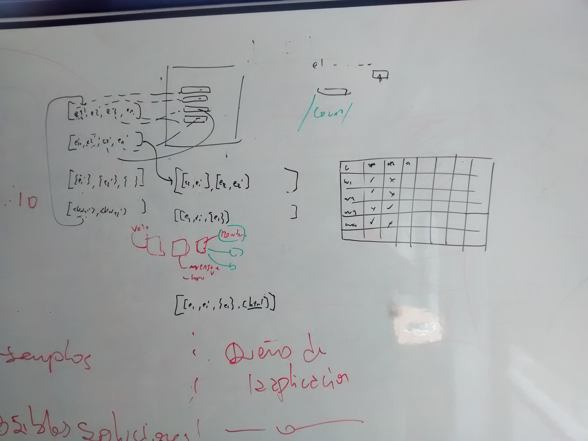

* Query -> Prepare-Statement
	* Ver si existe un patrón de Prepare-Statement
* Ir guardando todos los elementos de la cadena
	* Ver cómo mantener las referencias a todos los elementos intermedios: entre el HTML inicial y el HTML final, es decir (i.e.), a lo largo de la augmentation.

* Getter retorna un hash con los elementos
	* Ver cómo hacer que el Getter se aguante que le mandes la query y armarte el solito el hash.
* Hay un solo Builder. Recibe un template HTML. Puede recibir un sólo hash de los que da el Getter, o directamente una collection de hashes.
* Definir la primer parte (Extractor y Getter) y arrancar a implementarla.